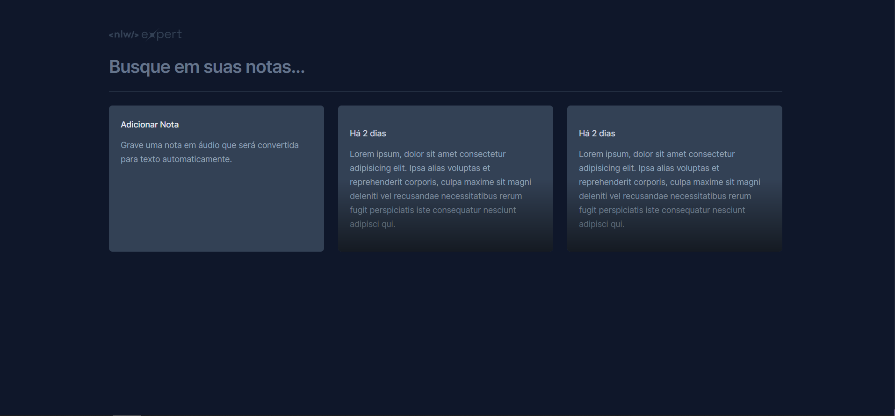
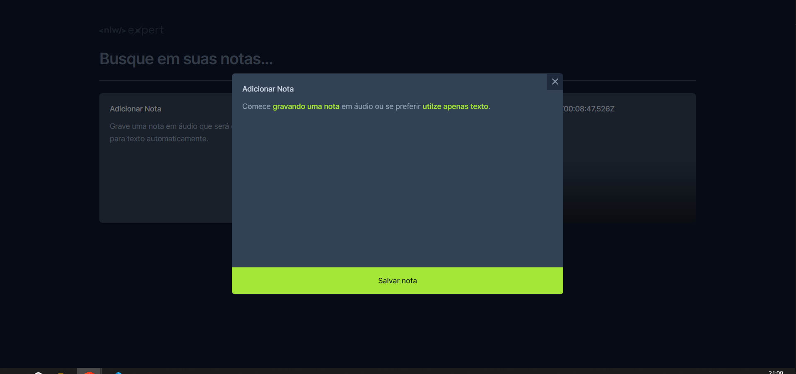
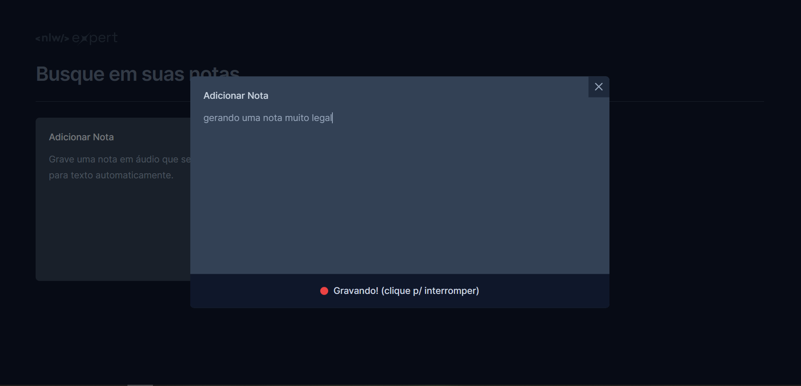

# NLW Expert - Notes APP

### Resultado Aula 1

### Resultado Aula 2

### Resultado Aula 3

### Principais aprendizados
<ul>
  <li>Tailwindcss - Estilização CSS dentro do HTML</li>
  <li>Vite - Webpack para criação de projetos</li>
  <li>Radix-ui - Biblioteca de Componentes</li>
  <li>Lucide-react - Icones</li>
  <li>Date-fns - Formatação de Datas</li>
  <li>Sonner - Pop up's de alerta</li>
  <li>Speech Recognition - API web que convert VOZ para TEXTO</li>
</ul>

### Quer ver como ficou?
<a href="https://65c56bbe3eab3433941d1595--grand-rugelach-7b5be4.netlify.app/">Abra aqui :dart:</a>
